# Rapport Projet JavaScript  
# Casse Brique 

## Contenu du Rapport
1. [Rôles et participation](#role)
2. [Outils et organisation](#outil)
3. [Diagrammes](#diagramme)
4. [Avancement du projet](#projet)
5. [Les règles](#regle)
6. [Nos problèmes](#probleme)

## <a id="role">**Rôles et participation des membres du projet :**</a>
---

- Scrum Master :
   - **Fontaneau Thomas**
      -  US02 - [La Raquette](#US2)
      -  Rédaction du rapport

- Product Owner :
    - **David Arthur**
      - US03 - [La balle](#US3)
      - Visuel du jeu
      - Création des maquettes du jeu
- Scrum Team :
    - **Mahé Mélina**
      - US04 - [Les briques](#US4)
      - Recherche et création des graphismes  
    - **Dubuis Ingrid**
      - US05 - [La mort du joueur](#US5)
      - Création de l'oral
    - **Etavard Cédric**
        - US09 - [Affichage des scores](#US9)
        - US10 - [Affichage du menu](#US10)
        - US06 - [Gestion des vies du joueur](#US6)
        - US07 - [Gestion du score](#US7)
  
 

## <a id="outil">**Outils et organisation**</a>
---

- [Discord](https://discord.com/channels/886308385677508738/955813976523018260) pour la communication d'informations. 
- [Trello](https://trello.com/b/uI0YcPtl/casse-brique) pour l'organisation des sprints et la répartition des tâches.
-  [Visual studio code](https://code.visualstudio.com/) pour l'IDE.
- [Git](https://gitlab.univ-lr.fr/cetavard/fontaneau_mahe_dubuis_david_etavard_progweb_cb) pour la gestion du code et des versions du code.

Pour la gestion du git nous avons procédé de la manière suivante : 
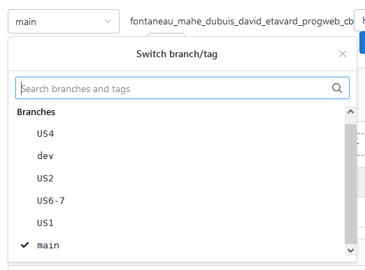 
Chaque US avait une branche basée sur la branche dev, une fois l'US finie, un merge sur la dev est effectué. Après vérification et résolution des éventuels conflits entre les US un merge du produit final est livré sur la main. 

## <a id="diagramme">**Diagrammes :**</a>
---
 
Pour partager les tâches dans le projet nous avons découpé nos différents composants (raquette, balle...) en classe. Voici le diagramme de classe que nous avons produit pour nous aider : 
 

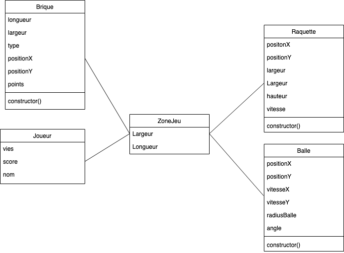 

## <a id="projet">**Avancement du projet :**</a>
---

### **Les fonctionnalités implémentées (découpées en US)**  

### <a id="US2">**US2 : La raquette**</a>

Cette US est divisée en 3 fonctionnalités et vise à créer une raquette qui se déplace en fonction de la flèche directionnelle pressée. 

 

- Création de la forme de la raquette 
 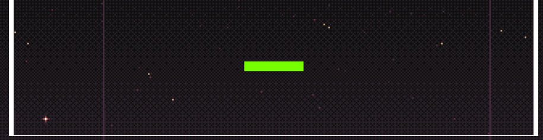 

- Gestion du mouvement de la raquette  
 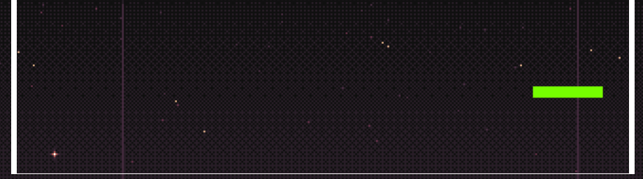 

- Mise en place d'un blocage avec les bords du terrain  
 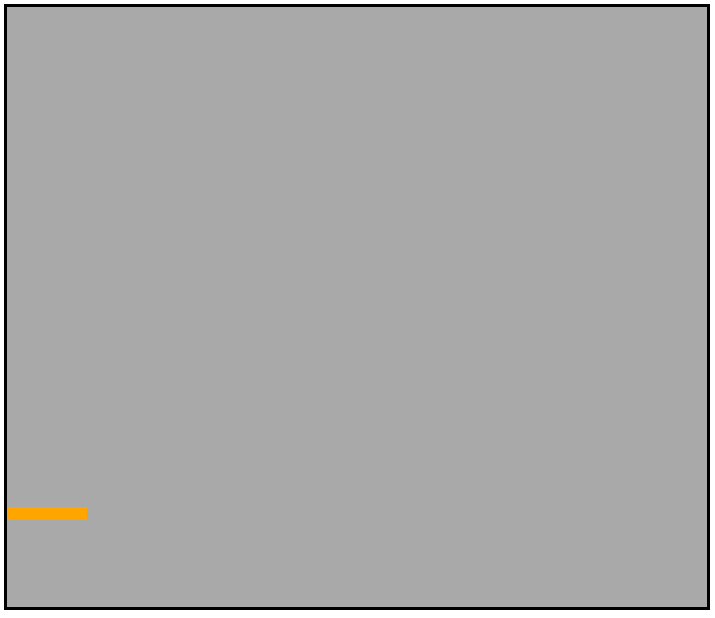 

### <a id="US3">**US3 : La balle**</a>

L'US est divisée en 4 fonctionnalités et vise à créer une balle qui se déplace et change de direction en fonction des obstacles rencontrés (mur,brique,raquette). 

- Création de la forme de la balle 
 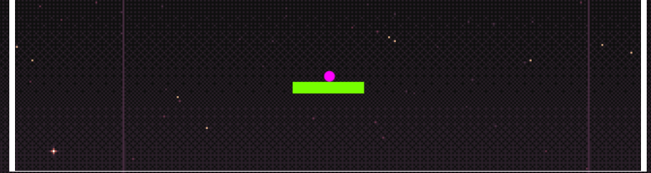 

- Gestion du mouvement de la balle  
 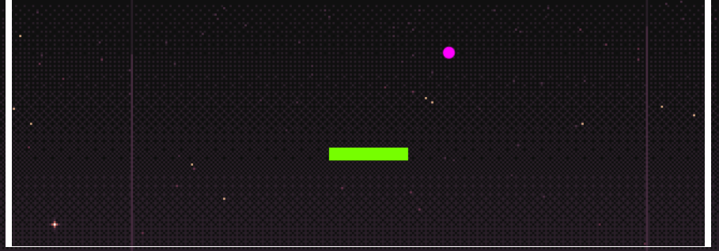 

- Mise en place des collisions    
 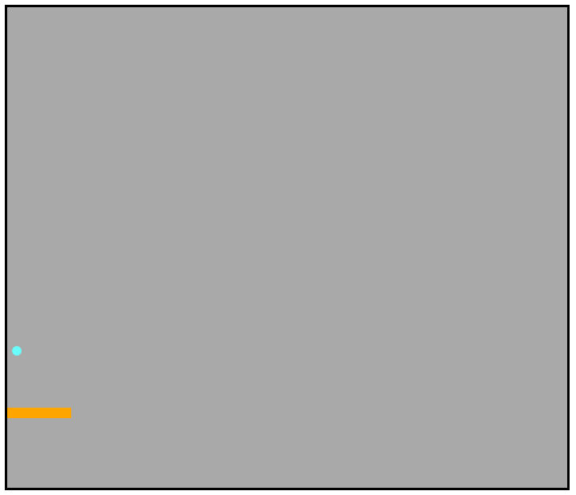 

- Mise en place des collisions avec les briques 
  

### <a id="US4">**US4 : Les briques**</a>
On retrouve 3 fonctionnalités dans cette US qui vise à créer un mur de briques composé de briques "normales" et de briques "vitesse" (augmente la vitesse de la balle), ainsi que la disparition des briques en cas de contact avec la balle. 

- Création des briques normales  
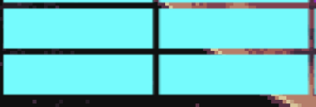 
- Création des briques vitesses  
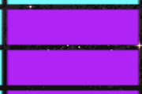 
- Gestion de la disparition des briques  
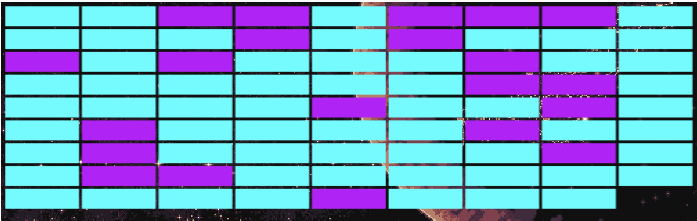 

### <a id="US5">**US5 : La mort du joueur**</a>
Cette US a pour rôle de détecter quand le joueur va perdre une vie c'est à dire quand la balle touche le bord inferieur du terrain. 

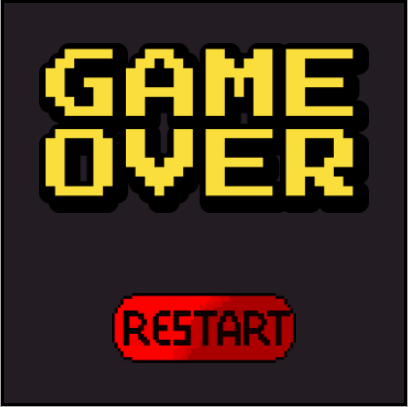 

### <a id="US6">**US6 : Gestion des vies du joueur**</a>
L'US gère le nombre de vies restantes du joueur qui en a 3 au départ et en perd une à chaque fois que la balle touche le bord inférieur. 

- Le joueur possède toute sa vie  
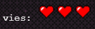 

- Le joueur perd une vie  
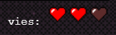 

### <a id="US7">**US7 : Gestion du score**</a>

Cette US permet d'ajouter au score du joueur des points en fonction des briques qu'il détruit. 

- Le joueur détruit une brique normale  
 

- Le joueur détruit une brique vitesse  
 

### <a id="US9">**US9 : Affichage des score**</a>
A l'aide du serveur fourni, l'US consiste à enregistrer le score du joueur actuellement en train de jouer. 

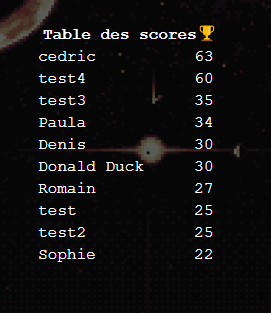 

### <a id="US10">**US10 : Affichage du menu**</a>
On retrouve 4 fonctionnalités dans l'US, avec un bouton start pour lancer le jeu, une zone où le joueur va inscrire son nom, les meilleur scores des autres joueurs et enfin les règles du jeu. 

- Score des meilleurs joueurs  
   
- Règles et nom du joueur    
   
- Changement du nom  
   

### **Les fonctionnalités manquantes**

### <a id="US8">**US8 : Gestion du passage de niveau**</a>
Quand le joueur détruit la dernière brique du niveau actuel le jeu passe au niveau suivant et un nouveau mur est créé. 

## <a id="regle">**Règles :**</a>
---

### Commande du jeu 

 --> Déplace la raquette vers la gauche. 

 --> Déplace la raquette vers la droite. 

### Déroulement d'une partie 

Une partie se lance quand le joueur entre un nom et appuie sur une des deux touches directionnelles (détaillé au-dessus). Le but du jeu est de détruire le plus de briques à l'aide d'une balle qui rebondit sur la raquette que nous contrôlons. Certaines briques sont dites "vitesse", lorque le joueur les détruit la vitesse de la balle augmente. Le joueur possède trois vies et en perd une à chaque fois que la balle touche le mur inférieur. La partie s'achève lorsque que le joueur perd ses trois vies. 

## <a id="probleme">**Les problèmes rencontrés :**</a>
---
Notre principal problème au cours de ce projet a été le temps. En effet vu que pour la plupart d'entre nous, nous n'avions jamais travaillé ensemble, nous avons perdu un peu de temps à s'organiser et à établir un plan clair. En parallèle nous avions déjà d'autres projets qui monopolisaient notre temps.