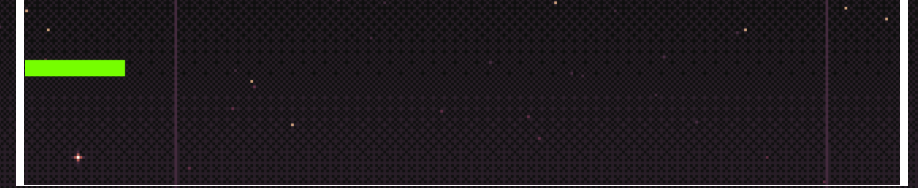

# Rapport Projet JavaScript  
# Casse Brique 

## Contenu du Rapport
1. [Rôle et participation](#role)
2. [Outils et organisation](#outil)
3. [Diagrammes](#diagramme)
4. [Avancement du projet](#projet)
5. [Les règles](#regle)
6. [Nos problèmes](#probleme)

## <a id="role">**Rôle et participation des membres du projet :**</a>
---

- Scrum Master :
    - Etavard Cédric
- Product Owner :
    - David Arthur
- Scrum Team :
    - Mahé Mélina 
    - Dubuis Ingrid
    - Fontaneau Thomas 

## <a id="outil">**Outils et organisation**</a>
---

- [Discord](https://discord.com/channels/886308385677508738/955813976523018260) pour la communication d'information. 
- [Trello](https://trello.com/b/uI0YcPtl/casse-brique) pour l'organisation des sprints et la repartition des tâches.
-  [Visual studio code](https://code.visualstudio.com/) pour l'IDE.
- [Git](https://gitlab.univ-lr.fr/cetavard/fontaneau_mahe_dubuis_david_etavard_progweb_cb) pour la gestion du code et des versions du code.

Pour la gestion du git nous avons procéde de la manière suivante :
 
Chaque US avait une branch sur la branch dev, une fois la US finit une merge sur la dev et effectué. Aprés vérification et résolution des éventuel conflits entre les US une merge du produit final et livrer sur la main.

## <a id="diagramme">**Diagrammes :**</a>
---

## <a id="projet">**Avancement du projet :**</a>
---

### **US2 : La raquette**

Cette US et divisé en 3 fonctionnalités et vise à crée une raquette que se déplace en fonction de la flèche directionnel pressé. 

- Création de la forme de la raquette 
  

- Gestion du mouvement de la Raquette  
  

- Mise en place d'un blocage avec les bords du terrain  
  

### **US3 : La balle**

Cette US et divisé en 4 fonctionnalités et vise à crée une balle que se déplace et change de direction en fonction des obstacles rencontré (mur,brique,raquette). 

- Création de la forme de la balle 
  

- Gestion du mouvement de la balle  
  

- Mise en place des collisions    
  

- Mise en place des collisions avec les briques 
  

## <a id="regle">**Règles :**</a>
---

## <a id="probleme">**Les problème rencontré :**</a>
---