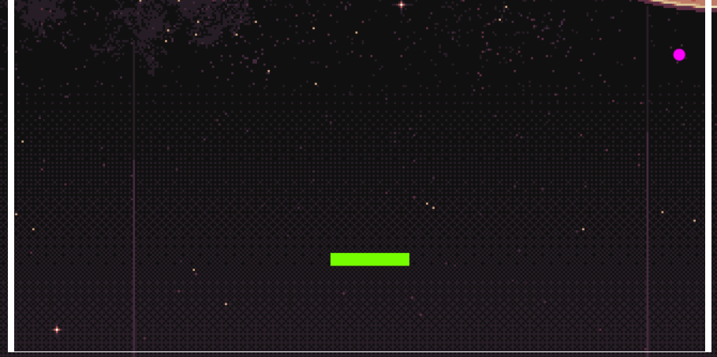

# Rapport Projet JavaScript  
# Casse Brique 

## Contenu du Rapport
1. [Rôle et participation](#role)
2. [Outils et organisation](#outil)
3. [Diagrammes](#diagramme)
4. [Avancement du projet](#projet)
5. [Les règles](#regle)
6. [Nos problèmes](#probleme)

## <a id="role">**Rôle et participation des membres du projet :**</a>
---

- Scrum Master :
    - **Etavard Cédric**
        - US09 - [Affichage des scores](#US9)
        - US10 - [Affichage du menu](#US10)
        - US06 - [Gestion des vies du joueu](#US6)
        - US07 - [Gestion du score](#US7)
- Product Owner :
    - **David Arthur**
      - US03 - [La balle](#US3)
      - Création des maquettes du jeu
- Scrum Team :
    - **Mahé Mélina**
      - US04 - [Les briques](#US4)
      - Recherche et création des graphismes  
    - **Dubuis Ingrid**
      - US05 - [La mort du joueur](#US5)
      - Création de l'oral
    - **Fontaneau Thomas**
      -  US02 - [La Raquette](#US2)
      -  Rédaction du rapport

## <a id="outil">**Outils et organisation**</a>
---

- [Discord](https://discord.com/channels/886308385677508738/955813976523018260) pour la communication d'information. 
- [Trello](https://trello.com/b/uI0YcPtl/casse-brique) pour l'organisation des sprints et la repartition des tâches.
-  [Visual studio code](https://code.visualstudio.com/) pour l'IDE.
- [Git](https://gitlab.univ-lr.fr/cetavard/fontaneau_mahe_dubuis_david_etavard_progweb_cb) pour la gestion du code et des versions du code.

Pour la gestion du git nous avons procéde de la manière suivante : 
 
Chaque US avait une branch sur la branch dev, une fois la US finit une merge sur la dev et effectué. Après vérification et résolution des éventuel conflits entre les US une merge du produit final et livrer sur la main. 

## <a id="diagramme">**Diagrammes :**</a>
---
 
Pour partager les taches dans le projet nous avons découpé nos diffèrent composent (raquette, balle...) en classe. Voici le digramme de classe que nous avons produit pour nous aider : 
 

 

## <a id="projet">**Avancement du projet :**</a>
---

### **Les fonctionnalités implémentées (découpé en US)**  

### <a id="US2">**US2 : La raquette**</a>

Cette US est divisée en 3 fonctionnalités et vise à crée une raquette que se déplace en fonction de la flèche directionnel pressé. 

 

- Création de la forme de la raquette 
  

- Gestion du mouvement de la Raquette  
  

- Mise en place d'un blocage avec les bords du terrain  
  

### <a id="US3">**US3 : La balle**</a>

L'US est divisée en 4 fonctionnalités et vise à crée une balle que se déplace et change de direction en fonction des obstacles rencontré (mur,brique,raquette). 

- Création de la forme de la balle 
  

- Gestion du mouvement de la balle  
  

- Mise en place des collisions    
  

- Mise en place des collisions avec les briques 
  

### <a id="US4">**US4 : Les briques**</a>
On retrouve 3 fonctionnalités dans cette API qui vise à crée un mur de brique composé de brique "normale" et de brique "vitesse" (augmente la vitesse de la raquette) ainsi que la disparition des briques en cas de contact avec la balle. 

- Création des briques normales  
 
- Création des briques vitesses  
 
- Gestion de la disparition des briques  
 

### <a id="US5">**US5 : La mort du joueur**</a>
Cette US a pour rôle détecter quand le joueur va perdre une vie c'est à dire quand la balle touche le bord inferieur du terrain. 

 

### <a id="US6">**US6 : Gestion des vies du joueur**</a>
L'US gère le nombre de vie restante du joueur il en a 3 de base et perd une vie à chaque fois que le détecte de la balle a touché le bord inferieur. 

- Le joueur possède toute sa vie  
 

- Le joueur perd une vie  
 

### <a id="US7">**US7 : Gestion du score**</a>

Cette US permet d'ajouter au score du joueur des points en fonction des briques qu'il détruit. 

- Le joueur détruit une brique normal  
 

- Le joueur détruit une brique vitesse  
 

### <a id="US9">**US9 : Affichage des score**</a>
A l'aide du serveur fournie l'US consiste à enregistrer le score du joueur actuellement en train de jouer. 

 

### <a id="US10">**US10 : Affichage du menu**</a>
On retrouve 4 fonctionnalités dans l'US, avec un bouton start pour lancer le jeu, une zone ou le joueur va inscrire son nom, les meilleur score des autres joueurs et enfin les règle du jeu. 

- Score des meilleur joueurs  
   
- Règle et nom du joueur    
   
- Changement du nom  
   

### **Les fonctionnalités manquantes**

### <a id="US8">**US8 : Gestion du passage de niveau**</a>
Quand le joueur détruit la dernière brique du niveau actuelle le jeu passe au niveau suivant et un nouveau mur est créé. 

## <a id="regle">**Règles :**</a>
---

### Commande du jeu 

 --> Déplace la raquette vers la gauche. 

 --> Déplace la raquette vers la droite. 

### Déroulement d'une partie 

Une partie ce lance quand le joueur entre un nom et appuyé sur une des deux touches directionnel (détaillé au-dessus). Le but du jeu est de détruire le plus de brique à l'aide d'une balle qui rebondie sur la raquette que nous contrôlons. Le joueur possède trois vies et en perd une à chaque fois que la balle touche le mur inferieur. La partie s'achevé lorsque que le joueur perd ces trois vies. 

## <a id="probleme">**Les problèmes rencontré :**</a>
---
